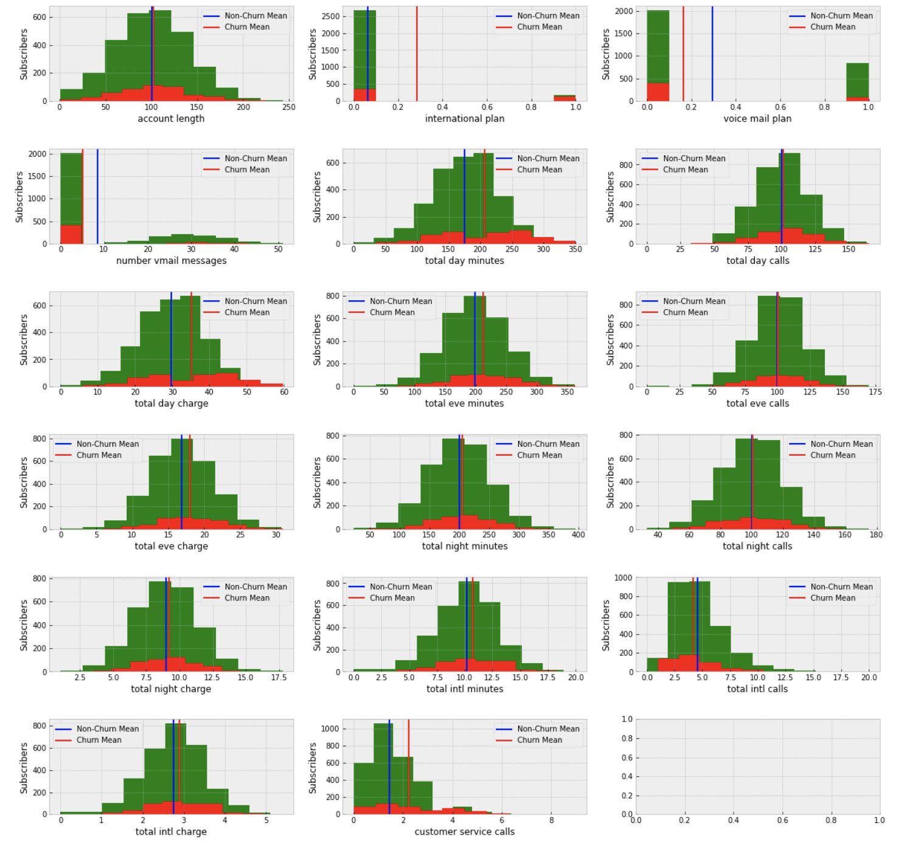
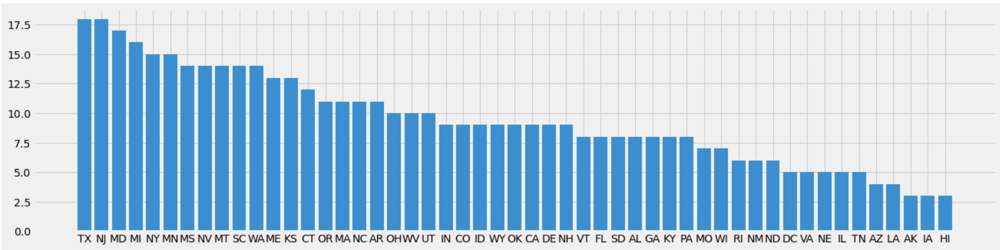
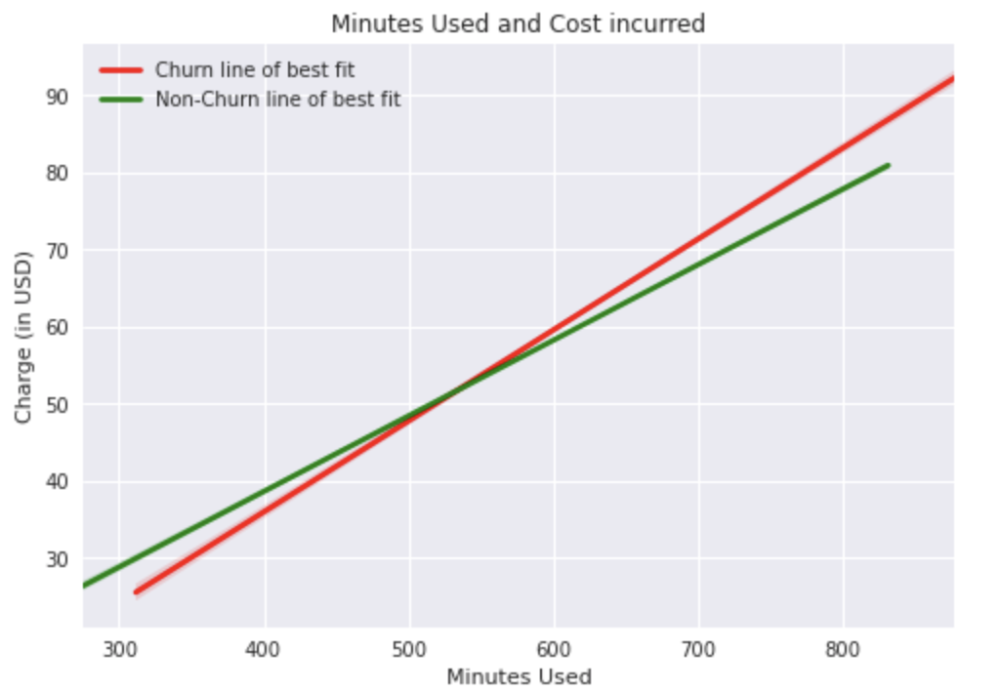
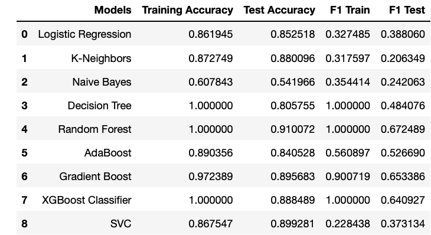
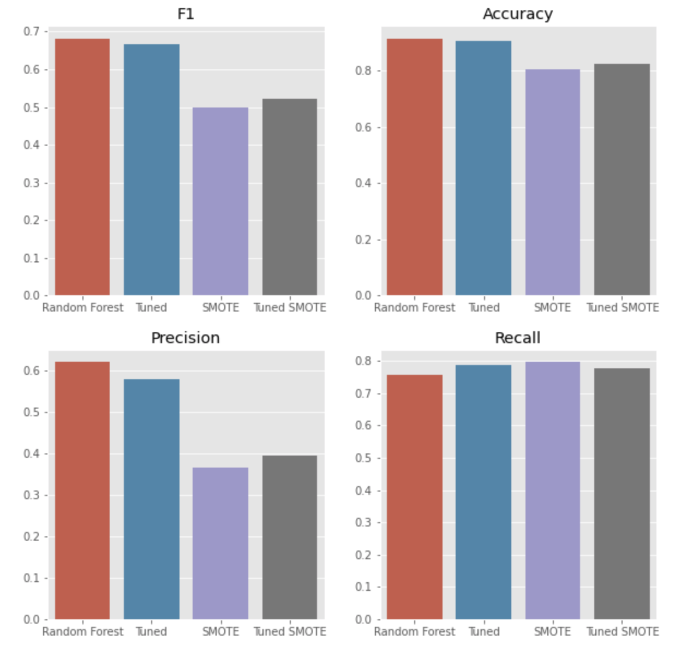
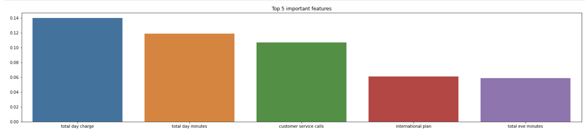
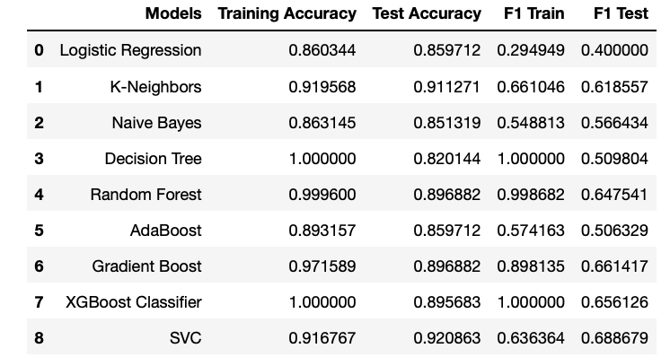
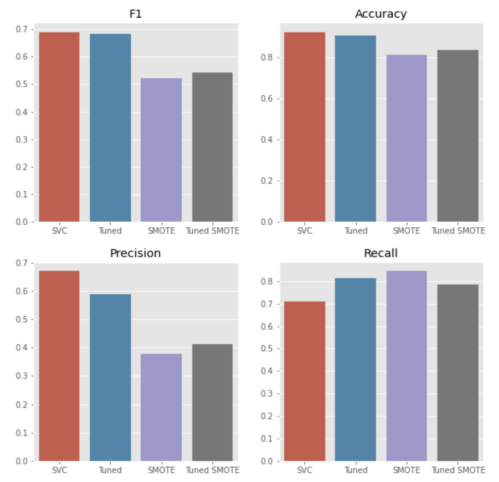

# Telecommunications Churn Analysis 
This analysis looks to answer the following questions:  
1) What characteristics do churn customers have?
2) What are the most important characteristics?
3) What model performs best in classifying churn correctly?  

# Data Description
The data set to examined contains information of 3,333 users. The information varies from phone number, region, usage, billing, features used, and if they are classified as a churn customer or not. The dataset can be found in the churn.csv file.

# Data Cleaning
The following was done to make the data useful for analysis:  

- Area code and phone number column were removed for privacy and for contributing very little to analysis.  
- "yes" values were turned into 1's and "no" values into 0s.
- State column was transformed into dummy variables and removed.

# Data Exploration
Initial analysis tried to differentiate churn customers and non-churn customers. The mean of each feature was taken in order to find any patterns. The means were not significantly different. Distribution plots showed that each feature followed a similar curve. The following are the distribution plots of all the features except for states and their means.

 

To further explore the data, churn customers by state were visualized.

There is a clear trend that Texas and New Jersey have the most churn customers. Hawaii has the least. From my experience of working in telecommunication sales, price was a big churn factor. Subscribers always wanted to get the lowest price, so the following shows how much subscribers pay per minute.

It can clearly be seen that churn customers pay more when they use more minutes than non-churn customers. However, non-churn customers pay more when they use less minutes.

# Modelling Churn
Multiple models were created in order to find the best one for this dataset. The following is a list of the models that were compared.

1) Logistic Regression
2) K-Nearest Neighbors
3) Naive Bayes
4) Decision Tree
5) Random Forest
6) AdaBoost
7) Gradient Boost
8) XGBoost Classifier
9) Support Vector Classifier

None of the models were tuned to the dataset in the beginning, and the following were the results.

Random forest was the model with the highest F1 score for the test set, so it was chosen to further explore.

### Exploring Random Forest
A couple experiments were performed in order to further enhance the performance of our random forest model. The following are two adjustments done to the model and dataset. 

1) Class imbalances were adjusted with synthetic sampling using SMOTE.
2) Hyper tuning was perform using grid search.  
    * Grid search form the Sklearn library was ran in google colab cloud computing services due to the magnitude of power needed to perform the calculations. F1 score was used as the scorer. 

With these 2 adjustments 3 models were created, and a fourth one served as a benchmark for these models.

  
  
It is apparent that the base random forest model without adjustments or synthetic sampling performed better in F1 score, accuracy, precision, and recall. From this model, the top features were extracted. The following are the top 5 features of the model. 

Total day charge, total day minutes, number of customer service calls, international plan, and evening minutes were the top features of the model. States were the least important.

### Continuation of Exploration
States were dropped from the available features, and all models were compared again.

  

On this iteration, support vector classifier performed the best. 

### Exploring SVC
The same process as [Random Forest Exploration](#exploring-random-forest) was performed, and the following were the results.

  

The tuned SVC was chosen because it had a higher recall than the vanilla SVC and performed better than the other models in accuracy and F1 score.  

# Conclusion
Features for churn and non-churn customers are very similar, so it can be hard to tell without a model which customer will turn out to be a churn customer or not a churn customer. However, something that stood out in the analysis is that churn customers pay more than non-churn customers when they use more minutes in their plan. When they use less minutes, they pay less than non-churn customers. In our random forest model, it indicates that daily minutes used, and daily amount charged are the top 2 most important indicators. Furthermore, Texas and New Jersey are the top 2 states with high customer churn. However, our random forest model indicated that state is not a reliable feature to indicate churn or non-churn. When removing states, random forest was no longer the best performing model and SVC performed the best. Furthermore, tuning the SVC model improved the recall measurement for the model. Recall was chosen over precision because the more positives we can achieve the better we can retain customers by offering incentives and minimizing the loss of revenue.

In recent years, cellular data has become more relevant than minutes. Many carriers offer unlimited minutes, text, and in some instances data. To bring this research to present time, data usage from customers’ needs to be collected to further understand how customers use their device and how more value can reduce churn rate. Last, more customer data is necessary to further improve investigations.   